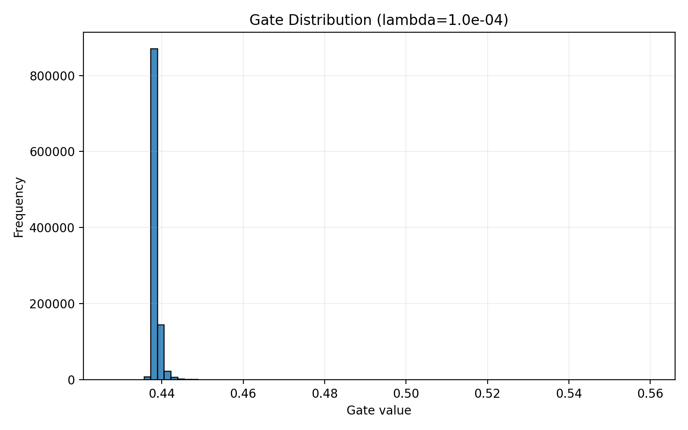

# Short Report: Self-Pruning Neural Network

## Why L1 Penalty on Sigmoid Gates Encourages Sparsity

Each weight is multiplied by a gate value:

$$
g_i = \sigma(s_i), \quad g_i \in (0,1)
$$

where $s_i$ is a learnable gate score and $\sigma$ is the sigmoid function.
The sparsity term adds the sum of all gate values to the loss:

$$
\mathcal{L}_{total} = \mathcal{L}_{CE} + \lambda \sum_i g_i
$$

Minimizing $\sum_i g_i$ pushes many gates toward very small values (near 0), which suppresses their corresponding weights. This effectively removes weak connections and yields a sparse network.

## Results Summary

| Lambda | Test Accuracy (%) | Sparsity Level (%) |
|---:|---:|---:|
| 1e-05 | 59.99 | 0.00 |
| 1e-04 | 60.12 | 0.00 |
| 1e-03 | 56.18 | 0.00 |

Best model by test accuracy: $\lambda = 1e\!-\!04$, Test Accuracy = 60.12%.

## Gate Value Distribution (Best Model)

Note: A strongly successful self-pruning outcome typically shows a large spike near 0 and another cluster away from 0. In this short run (3 epochs, CPU), sparsity remained 0.00%, so stronger/longer training is needed to observe that behavior clearly.
